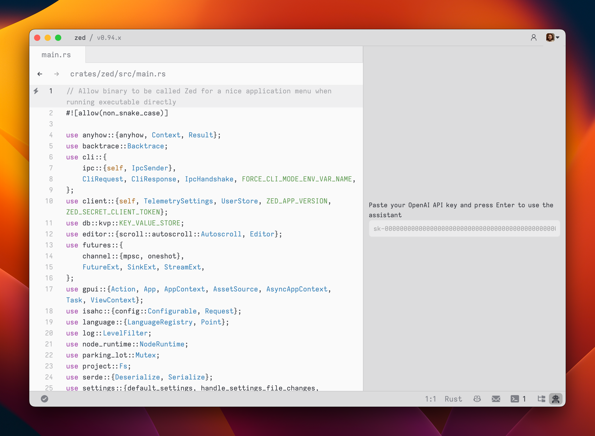
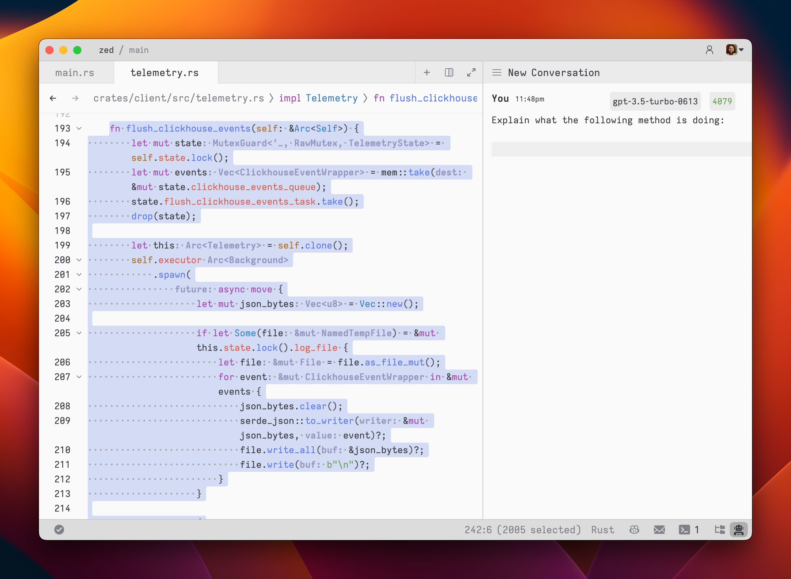
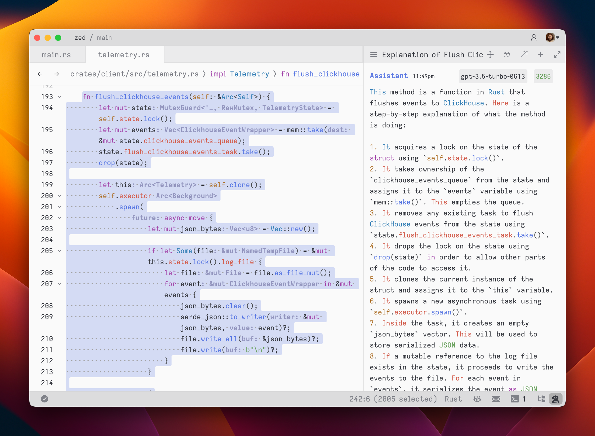

# Assistant Panel

The assistant panel provides you with a way to interact with OpenAI's large language models. The assistant is good for various tasks, such as generating code, asking questions about existing code, and even writing plaintext, such as emails and documentation. To open the assistant panel, toggle the right dock by using the `workspace: toggle right dock` action in the command palette (`cmd-shift-p`).

*Note: A default binding can be set to toggle the right dock via the settings.*

## Setup

When you first open the panel, Zed will ask you for an [OpenAI API key](https://platform.openai.com/account/api-keys), which is saved to your keychain.

Zed will also use the `OPENAI_API_KEY` environment variable if it's defined. If you need to reset your OpenAI API key, focus on the assistant panel and run the command palette action `assistant: reset key`.

## Having a conversation

The assistant editor in Zed functions similarly to any other editor. You can use custom key bindings and work with multiple cursors, allowing for seamless transitions between coding and engaging in discussions with the language models. However, the assistant editor differs with the inclusion of message blocks. These blocks serve as containers for text that correspond to different roles within the conversation. These roles include:

- `You`
- `Assistant`
- `System`

To begin, select a model and type a message in a `You` block.

As you type, the remaining tokens count for the selected model is updated.

Inserting text from an editor is as simple as highlighting the text and running `cmd->` (`assistant: quote selection`); Zed will wrap it in a fenced code block if it is code.

To submit a message, use `cmd-enter` (`assistant: assist`). Unlike typical chat applications where pressing `enter` would submit the message, in the assistant editor, our goal was to make it feel as close to a regular editor as possible. So, pressing `enter` simply inserts a newline.

After submitting a message, the assistant's response will be streamed below, in an `Assistant` message block.

The stream can be cancelled at any point with `escape`. This is useful if you realize early on that the response is not what you were looking for.

If you want to start a new conversation at any time, you can use the `New Conversation` button located at the top-right corner of the assistant panel.

Simple back-and-forth conversations work well with the assistant. However, there may come a time when you want to modify the previous text in the conversation and steer it in a different direction.

## Editing a conversation

The assistant gives you the flexibility to have control over the conversation. You can freely edit any previous text, including the responses from the assistant. If you want to remove a message block entirely, simply place your cursor at the beginning of the block and use the `delete` key. A typical workflow might involve making edits and adjustments throughout the conversation to refine your inquiry or provide additional context. Here's an example:

1. Write text in a `You` block.
2. Submit the message with `cmd-enter`
3. Receive an `Assistant` response that doesn't meet your expectations
4. Cancel the response with `escape`
5. Erase the content of the `Assistant` message block and remove the block entirely
6. Add additional context to your original message
7. Submit the message with `cmd-enter`

Being able to edit previous messages gives you control over how tokens are used. You don't need to start up a new conversation to correct a mistake or to add additional context and you don't have to waste tokens by submitting follow-up corrections.

Some additional points to keep in mind:

- You are free to change the model type at any point in the conversation.
- You can cycle the role of a message block, by clicking on the role, which is useful when you receive a response in an `Assistant` block that you want to edit and send back up as a `You` block.

## Saving a converation

After you submit your first message, a name for your conversation is generated by the language model, and the conversation is automatically saved to your file system in `~/.config/zed/conversations`. You can access and load previous messages by clicking on the hamburger button in the top-left corner of the assistant panel.

## Multiple cursor demo

The assistant is capable of sending multiple requests, and receiving multiple responses, in parallel. [Here's a demo](https://zed.dev/img/post/assistant/demo.webm).
